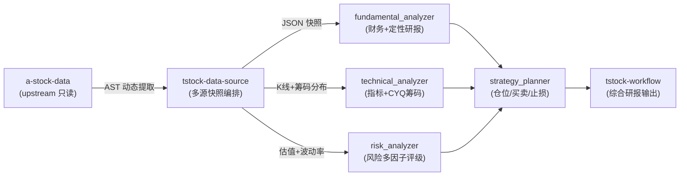

# AGENTS.md

本文件为智能体（Agents）在维护、扩展和运行 `tstock-skills` 仓库时提供架构认知、执行指令与协作契约。

---

## 1. 系统定位与执行流 (System Role & Pipeline)

`tstock-skills` 是模块化构建的 A 股智能投研与量化分析系统。每个 Skill 均为独立的 Python CLI 工具，通过标准 JSON 契约解耦通信，由 `tstock-workflow` 编排为端到端投资分析报告。



---

## 2. 核心命令集 (Commands)

本项目严格使用 **`uv`** 管理依赖与运行环境，严禁原生 `venv`。

```bash
# 1. 全流程串联分析（输出综合 Markdown 投资分析报告）
uv run python tstock-workflow/scripts/workflow.py 600519 --pretty
uv run python tstock-workflow/scripts/workflow.py 300308 --output /tmp/300308_report.json --refresh-data

# 2. 单点 Skill 调试与运行
# 统一数据源快照 (core: 毫秒级核心快照 / all: 包含三表与微观结构)
uv run python tstock-data-source/scripts/data_source.py --code 600519 --data-type core
uv run python tstock-data-source/scripts/data_source.py --code 600519 --data-type all --output /tmp/600519_snapshot.json

# 各独立分析器运行
uv run python tstock-fundamental_analyzer/scripts/fundamental_analyzer.py --snapshot /tmp/600519_snapshot.json --output /tmp/600519_fund.json
uv run python tstock-technical_analyzer/scripts/technical_analyzer.py --snapshot /tmp/600519_snapshot.json --output /tmp/600519_tech.json
uv run python tstock-risk_analyzer/scripts/risk_evaluator.py --snapshot /tmp/600519_snapshot.json --output /tmp/600519_risk.json
uv run python tstock-portfolio/scripts/strategy_planner.py --code 600519 --fundamental /tmp/600519_fund.json --technical /tmp/600519_tech.json --risk /tmp/600519_risk.json

# 自选股管理
uv run python tstock-portfolio/scripts/watchlist_manager.py list
uv run python tstock-portfolio/scripts/watchlist_manager.py add --code 600519 --name 贵州茅台 --group 消费白酒

# 3. 单元测试与上游版本审计
uv run python -m unittest discover -s tests
uv run python scripts/audit_upstream_astock.py
```

---

## 3. 架构规范与数据源容灾矩阵 (Data Architecture)

### 3.1 上游吸收模式 (Upstream Decoupling)
- **只读协议**：`~/Projects/upstream/a-stock-data` 保持为纯净 Git 仓库，不做本地修改。
- **AST 动态加载器**：通过 `tstock_data_source/providers/astock_adapter/loader.py` 在内存中用 Python AST 提取函数与网络配置单例，剥离顶层运行代码，实现上游 `git pull` 无缝平滑升级。

### 3.2 数据源多级梯度容灾 (Failover Matrix)

| 数据维度 | 首选源 (Primary) | 备选源 (Secondary) | 兜底源 (Fallback) | 决策考量 |
| :--- | :--- | :--- | :--- | :--- |
| **基础信息 / 盘口** | **`astock.tencent`** | AkShare 个股信息 | Baostock | 腾讯 HTTP 直连毫秒响应、零鉴权免封 |
| **历史 K 线 / 盘口** | **AkShare / Baostock** | `astock.mootdx` | - | 通达信 TCP 7709 受限网络下平滑降级 |
| **财报三表** | **`astock.sina`** | AkShare 财报接口 | Baostock 财务指标 | 新浪接口单次拉取仅需 1s，免除 AkShare 全量深度翻页挂起 |
| **筹码分布 (CYQ)** | **`astock.chip_distribution`** | - | - | 基于时序日 K 与换手率的三角网格衰减推演 |
| **微观结构 / 概念** | **`astock.eastmoney`** | 问财 API | - | 东财 `em_get` 串行节流保护（单 IP 1s 间隔） |

---

## 4. 智能体协作与编码守则 (Agent Conventions)

1. **单点真理原则 (Single Source of Truth)**：
   - 基础公共逻辑位于 `tstock_lib/`（如 `safe_float`, `normalize_code`, `constants.py`），严禁在业务 Skill 内重复实现或硬编码阈值。
   - 所有外部路径与密钥统一由根目录 `config.py` 解析，优先读取环境变量。
2. **手术式精细修改 (Surgical Changes)**：
   - 严格遵循任务目标，不改动相邻无故障代码或格式。
   - 保持向下兼容：下游分析模块消费标准 JSON 字典，不得因底层新增数据源破坏已有字段。
3. **不可逆操作安全规范**：
   - 文件删除**强制优先使用 `~/.local/bin/trash-put`**，禁止直接执行 `rm -rf`。
   - 不可逆操作（删除文件、`git reset --hard`、force push 等）必须先向用户说明理由和影响，确认后方可执行。
4. **验证闭环**：
   - 涉及数据源变动，必须运行 `uv run python -m unittest discover -s tests` 确保单测全绿。
   - 涉及分析链路改动，必须运行 `workflow.py` 验证端到端 Markdown 报告生成正常。

---

## 5. 参考文档指针 (Context Pointers)

- **演进路线与实施规划**：查阅 [`PLAN.md`](PLAN.md)，跟踪阶段一至阶段四落地细节及阶段五至阶段八待实施方案。
- **上游端点映射规范**：查阅 [`ASTOCK_MAPPING.md`](tstock-data-source/references/ASTOCK_MAPPING.md)，查阅 60 个直连端点的参数规范与防封注意事项。
