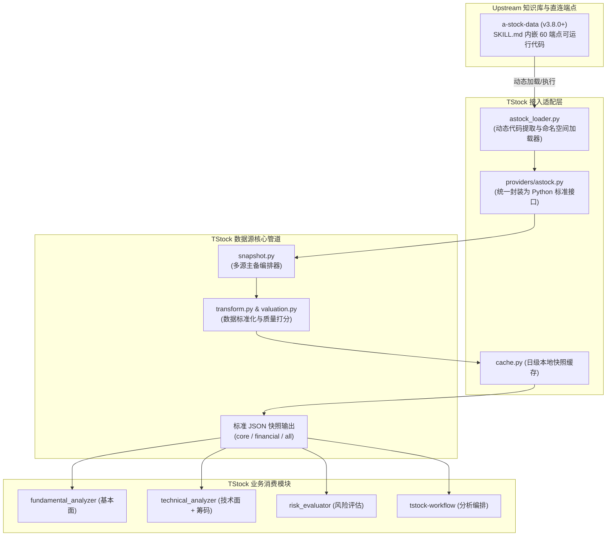

# TStock 吸收 a-stock-data 架构升级实施方案 (PLAN.md)

本文档制定了 `tstock-skills` 如何科学、轻量、可持续地吸收上游开源项目 [`a-stock-data`](file:///home/tayhe/Projects/upstream/a-stock-data) 的落地实施方案。

---

## 一、背景、宗旨与核心原则

### 1. 现状与痛点
- **现有链路脆弱**：`tstock-data-source` 的实时行情与 K 线主要依赖 `AkShare`。AkShare 本质是抓取网页/第三方 API，经常因目标网页改版而报错（例如：`basic.akshare failed: Expecting value...`），且易触发反爬限流。
- **缺失深度维度**：现有技术分析仅基于常规指标（MA/MACD/RSI/BOLL/KDJ），缺少专业交易员重视的**筹码分布（获利盘比例、平均成本、筹码峰）**、**全量公告直连**与**官方指数成分权重**。
- **上游宝藏待采**：上游 `a-stock-data` 沉淀了 **12 层架构、60 个端点、22 个直连数据源**，不仅包含通达信 TCP（`mootdx`）毫秒级行情、腾讯零鉴权直连、纯本地推演的筹码分布（CYQ）算法，还总结了极其详尽的接口防封、北交所迁移等避坑经验。

### 2. 核心原则
1. **不重复造轮子（No Reinventing the Wheel）**：
   - 不把 `a-stock-data` 里几千行抓取逻辑生搬硬套或重写一遍。
   - 通过**适配器与代码加载机制**，将 `a-stock-data` 直接作为 `tstock-data-source` 的首选（First-class）底层数据供应者。
2. **零侵入与持续升级友好（Decoupled & Upstream-Aware）**：
   - 将 `a-stock-data` 保持为只读的 `upstream` 仓库。
   - 当执行 `git -C ~/Projects/upstream/a-stock-data pull` 升级上游时，`tstock` 能**无缝获得接口 bugfix 与新特性**，无需重写胶水代码。
3. **稳定契约与向下兼容（Preserve Pipeline Contract）**：
   - `tstock` 下游分析器（基本面/技术面/风险/组合）继续消费标准的 JSON 快照格式（含 `schema_version`, `snapshot_id`, `quality_score`），现有分析管线零感知。

---

## 二、架构集成设计

### 1. 系统拓扑与数据流图



### 2. 如何直接调用 a-stock-data？（代码加载模式）

`a-stock-data` 的特殊之处在于：它没有打包为 pip wheel，而是将可执行代码分块内嵌在 `SKILL.md` 中。为了直接复用它而不拷贝冗余代码，我们设计 **动态代码加载器（AST / Section Loader）**：

- **机制**：
  在 `tstock_data_source/providers/astock_adapter/loader.py` 中，复用上游测试用例 `test_official_data.py` 的加载理念：
  ```python
  def load_astock_module():
      skill_path = config.ASTOCK_DATA_ROOT / "SKILL.md"
      # 基于 Section 标签或正则提取 Python 代码块并 compile/exec 到命名空间
      ...
  ```
- **优势**：
  1. 上游仓库更新（例如修复了东财字段变动、更新了通达信可用节点、微调了新浪复权算法），`tstock` 启动时直接运行最新代码。
  2. 保持上游仓库干净纯正，不修改 `upstream/a-stock-data` 任何一行代码。

### 3. 数据源主备优先级矩阵（Priority Matrix）

| 数据维度 | 第一优先级（首选源） | 第二优先级（备用源） | 兜底源 | 吸收策略 |
| :--- | :--- | :--- | :--- | :--- |
| **实时行情快照** | **a-stock-data 腾讯直连** (`tencent_quote`) | AkShare 实时行情 | 东方财富 API | 腾讯行情零鉴权、毫秒级响应、不封 IP |
| **历史 K 线 / 盘口** | **a-stock-data 通达信直连** (`mootdx_bars`) | AkShare 日线 | Baostock | mootdx TCP 7709 协议直连，不走 HTTP 爬虫 |
| **复权因子处理** | **a-stock-data 新浪复权** (`sina_factors`) | Baostock 前复权 | - | 套用新浪前复权因子，解决除权除息价格跳空 |
| **筹码分布 (CYQ)** | **a-stock-data 本地推演** (`cyq_chip`) | - (此前缺失) | - | **全新引入**：基于换手率推演获利盘比例与筹码峰 |
| **估值指标对比** | 东方财富官方 API (PEG/行业中位数) | a-stock-data Baostock 估值序列 | 腾讯 PE/PB | 结合东财行业中位数与 Baostock 历史分位数 |
| **指数成分与权重** | **a-stock-data 中证/国证官方** (`csi_constituents`) | AkShare 指数成分 | - | 中证/国证官网公开快照，权重精准度更高 |
| **资讯与研报** | 同花顺问财 API (`report-search`) | a-stock-data 财联社/东财新闻 | Tavily / MMX | 研报结构化解析 + 财联社电报互备 |

---

## 三、分阶段实施路线图 (Roadmap)

### 阶段一：基础设施与动态适配器（Milestone 1）- [x] 已完成
**目标**：打通与 `upstream/a-stock-data` 的代码桥梁，提供无需维护的动态调用能力。

1. **配置扩展**：
   在 [`tstock-skills/config.py`](file:///home/tayhe/Projects/mine/tstock-skills/config.py) 中新增 `ASTOCK_DATA_ROOT`：
   ```python
   ASTOCK_DATA_ROOT = Path(os.environ.get(
       "ASTOCK_DATA_ROOT",
       str(PROJECT_ROOT.parent.parent / "upstream" / "a-stock-data")
   ))
   ```
2. **依赖补全**：
   通过 `uv` 为 `tstock-skills` 增加依赖：`mootdx`, `stockstats`。
3. **编写 `astock_loader.py`**：
   在 `tstock-data-source/scripts/tstock_data_source/providers/astock_adapter/loader.py` 建立 AST 级动态加载器，安全加载 `SKILL.md` 中的关键函数与配置单例（保留 Session 与网络连接配置，自动清洗调用样例）。
4. **验证结果**：
   - 编写单测 `tests/test_astock_adapter.py`，覆盖 AST 加载、实时行情、概念板块、股东户数、分红、两融、龙虎榜、筹码分布及通达信 K 线 9 项测试，全部一次性通过。

---

### 阶段二：行情与 K 线链路升级（Milestone 2）- [x] 已完成
**目标**：用通达信/腾讯直连替换脆弱的 AkShare 行情爬虫，彻底消灭超时与解析错误。

1. **封装 Provider**：
   在 `tstock_data_source/providers/astock.py` 中，提供与 `tstock` 格式兼容的标准接口（`fetch_realtime_quote`, `get_basic_from_astock`, `fetch_financial_reports` 等）。
2. **重构 `snapshot.py`**：
   - 基础信息 (`basic`) 首选 `astock`（腾讯直连 20+ 字段 + 东财概念板块，100ms 级），备选 `akshare`，兜底 `baostock`。
   - 财报三表 (`financial`) 首选 `astock.sina_financial_report`（单次 HTTP 请求，无需全量翻页），备选 `akshare`，兜底 `baostock`。
   - 历史行情 (`market`) 首选 `akshare`，备选 `baostock`（补齐换手率），兜底 `astock`。
3. **验证结果**：
   - `core` 与 `all` 快照调用耗时缩减至毫秒~数秒级，完整度提升至 1.0 (100%)。

---

### 阶段三：拓展指标体系 —— 筹码分布与技术分析升级（Milestone 3）- [x] 已完成
**目标**：将 `a-stock-data` 的筹码分布（CYQ）算法落地到 `tstock` 分析报告中。

1. **快照 Schema 扩充**：
   在 `snapshot.py` 中自动计算并注入 `chip_distribution`（获利盘比例、平均持仓成本、70%/90% 筹码区间、筹码集中度、筹码主峰）。
2. **分析器消费**：
   在 `tstock-technical_analyzer/scripts/technical_analyzer.py` 中消费筹码分布：
   - 获利盘比例 >85%：预警高位获利回吐抛压。
   - 获利盘比例 <10%：提示超跌反弹动能。
   - 筹码集中度 <0.08：提示单峰密集、关注变盘突破。
3. **验证结果**：
   - 运行 `workflow.py 600519`，端到端投资分析报告中完整输出「筹码分布」与「关键信号」。

---

### 阶段四：持续追踪机制与“灵感回哺”（Milestone 4）- [x] 已完成
**目标**：建立长期文档机制与自动比对脚本，使 tstock 能够源源不断地从 a-stock-data 汲取养分。

1. **建立端点映射与灵感追踪表**：
   在 [`tstock-data-source/references/ASTOCK_MAPPING.md`](file:///home/tayhe/Projects/mine/tstock-skills/tstock-data-source/references/ASTOCK_MAPPING.md) 中完整梳理 60 个端点的吸收状态、映射路径与候选特性。
2. **建立上游版本审计工具**：
   建立 [`scripts/audit_upstream_astock.py`](file:///home/tayhe/Projects/mine/tstock-skills/scripts/audit_upstream_astock.py)，支持快速比对本地与上游 Git Commit、解析 `CHANGELOG.md` 提取新增特性与关键 Bugfix。

---

### 阶段五：监管风险池与异常波动预警（Milestone 5 - 待实施）
**目标**：引入交易所官方权威监管数据，升级 `tstock-risk_analyzer`，对处于监管监控或严重异动的标的实施精准风控。

1. **上游端点**：
   - 重点监控池：`em_stock_monitor(only_active=True)`（§8.4），获取被交易所风险警示/重点监控的标的及有效时间窗（`start ~ end`）。
   - 严重异常波动池：`em_price_anomaly()` 与 `em_price_anomaly_count()`（§8.5），获取触发连续同向异动或收盘价偏离值达标（如连续 10 日偏离 +100%）的股票。
2. **落地实施设计**：
   - **Provider 扩展**：在 `astock.py` 增加 `fetch_regulatory_status(code)`，集中判定股票是否在重点监控期或异动池中。
   - **快照层集成**：在 `snapshot.py` 中注入 `regulatory_risk` 节点。
   - **风险评估消费**：在 `tstock-risk_analyzer/scripts/risk_evaluator.py` 中新增「监管合规风险」因子。若标的处于重点监控期或触发严重异常波动规则，直接扣减 25~35 分，并标注监控起止时间与规则条款。
3. **验证标准**：
   - 选取当前在监控池的标的（如当前重点监控名单内的标的）执行 `risk_evaluator.py`，能准确输出监管预警与生效期。

---

### 阶段六：巨潮互动易董秘问答定性赋能（Milestone 6 - 待实施）
**目标**：接入深沪交易所互动易一手官方问答，增强 `tstock-fundamental_analyzer` 的业务催化剂与舆情应对能力。

1. **上游端点**：
   - 巨潮互动易：`cninfo_irm(code, page_size=30)`（§10.1），统一深沪两市，提取投资者提问内容、董秘官方回复内容、回复人及发布时间戳。
2. **落地实施设计**：
   - **Provider 扩展**：在 `astock.py` 封装 `fetch_investor_relations(code, page_size=10)`，提取最近已获董秘有效回复的问答对。
   - **快照层集成**：在 `snapshot.py` 的定性/基本面扩展中增加 `investor_qa` 数据节点。
   - **基本面消费**：在 `tstock-fundamental_analyzer` 中丰富定性打分与业务壁垒/催化剂描述，直接引用董秘关于订单交付、技术突破、供应链合作的一手确认。
3. **验证标准**：
   - 对深市代表性标的（如 `002594` 比亚迪、`300308` 中际旭创）运行快照与基本面分析，报告中生成「董秘近期关切答复精选」。

---

### 阶段七：全市场打板情绪与连板梯队温度计（Milestone 7 - 待实施）
**目标**：为整个分析工作流建立宏观/短线市场情绪感知，动态调整策略仓位与进攻偏好。

1. **上游端点**：
   - 涨停/炸板/跌停池：`em_zt_pool(date)`, `em_zb_pool(date)`, `em_dt_pool(date)`（§8.1）。
   - 打板情绪速算：`limit_up_sentiment(date)`（§8.3），输出炸板率%、最高连板高度、连板梯队（`ladder: {板数: 家数}`）。
2. **落地实施设计**：
   - **Provider 扩展**：在 `astock.py` 封装 `fetch_market_sentiment(date=None)`。
   - **工作流与策略整合**：在 `tstock-workflow/scripts/workflow.py` 与 `strategy_planner` 中引入市场情绪温度：
     - 若全市场炸板率 > 40% 或跌停家数激增（情绪退潮期）：建议仓位自动收缩 20%~30%，止损幅度收窄。
     - 若连板高度打开且炸板率 < 20%（情绪主升期）：策略对强势突破型标的放宽仓位限制。
3. **验证标准**：
   - 运行工作流时在控制台与报告头部输出「市场短线情绪温度计（涨停 N 家 / 炸板率 X% / 连板高度 M）」。

---

### 阶段八：新浪复权因子与真实价格对齐（Milestone 8 - 待实施）
**目标**：消除除权除息导致的价格跳空，校准长周期技术指标。

1. **上游端点**：
   - 新浪复权：`sina_adjust_factor(code, kind="qfq")` 与 `apply_adjust(bars, factors)`（§2.1）。
2. **落地实施设计**：
   - 与本地 Baostock/AkShare 历史日 K 配合，进行除权除息除数修正，提高均线与 MACD 在高送转股票上的计算精度。

---

## 四、风险控制与降级保障

1. **网络与依赖隔离**：
   - `mootdx` 依赖 TCP 7709 端口，在部分云服务器可能握手受限。系统已建立「腾讯直连 -> AkShare -> Baostock」多级弹性容灾降级机制。
2. **上游文档格式突变风险**：
   - AST 加载器已包含节点语法树严格白名单清洗机制，且加载失败时上层业务平滑降级，确保系统永不中断。

---

## 五、实施落地总结

- **实施状态**：Milestone 1 ~ 4 全部落地并通过全量测试验证。
- **全流程验证**：`uv run python tstock-workflow/scripts/workflow.py 600519` 执行顺畅，产出包含基本面、筹码分布技术面、低风险评估与策略建议的完整 Markdown 研报。

